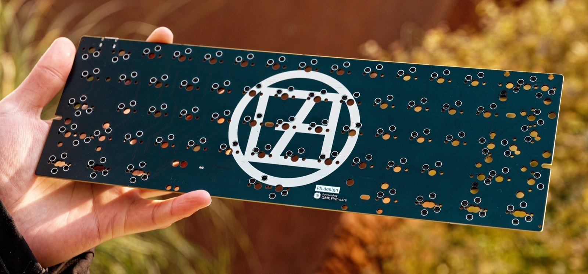

# zkforge/ph60_multi

> Forked from:
>
> -   commit hash: `802a199bbd5dc5a533d912b1e508a84d1de08724`
> -   keyboard: phdesign/ph60/multi

A 60% multi-layout keyboard PCB.

-   Keyboard Maintainer: [Team PHDesign](https://github.com/ph-design)
-   Hardware Supported: PH60/Multi PCB
-   Hardware Availability:
    -   Store: https://e.tb.cn/h.6VMjUgWZkUGwq26?tk=oVyAeD6uPS2
    -   GitHub Repo: https://github.com/ph-design/PH60/tree/Rev.2/PCB_Rev2/Multi

Make example for this keyboard (after setting up your build environment):

    qmk compile -kb zkforge/ph60_multi -km default

Flashing example for this keyboard:

    qmk flash -kb zkforge/ph60_multi -km default

See the [build environment setup](https://docs.qmk.fm/#/getting_started_build_tools) and the [make instructions](https://docs.qmk.fm/#/getting_started_make_guide) for more information. Brand new to QMK? Start with our [Complete Newbs Guide](https://docs.qmk.fm/#/newbs).

## Bootloader

Enter the bootloader in 3 ways:

-   **Bootmagic reset**: Hold down the key at (0,0) in the matrix (usually the top left key or Escape) and plug in the keyboard.
-   **Keycode in layout**: Press the key mapped to `QK_BOOT` if it is available.
-   **Physical reset button**: Briefly press the button on the back of the PCB - some may have pads you must short instead.
