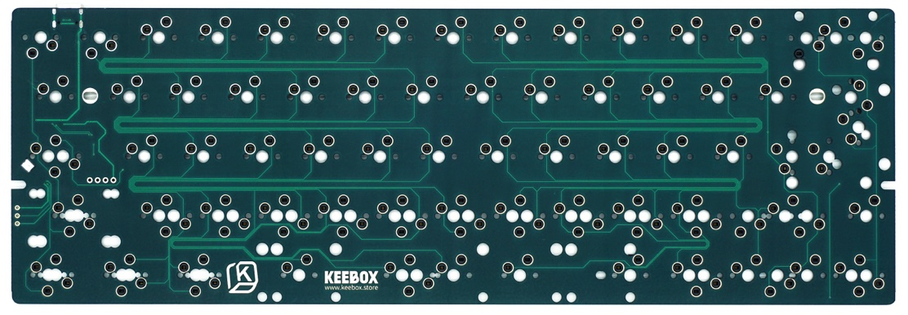

# zkforge/yr6095

> This is only for the wired-only PCB, not the tri-mode PCB.

> Forked from:
>
> -   commit hash: `802a199bbd5dc5a533d912b1e508a84d1de08724`
> -   keyboard: yandrstudio/yr6095

A 60% multi-layout keyboard PCB.

This keyboard uses APM32F103CBT6(STM32F103CBT6) as MCU, but with 16mhz HSE.

-   Keyboard Maintainer: https://github.com/jiaxin96
-   Hardware Supported: YR6095 PCB
-   Hardware Availability:
    -   Keebox60 R2 PCB - [Keebox Store](https://keebox.store/products/keebox60-r2-pcb) / [Taobao](https://item.taobao.com/item.htm?id=800145163764)

Make example for this keyboard (after setting up your build environment):

    qmk compile -kb zkforge/yr6095 -km default

Flashing example for this keyboard:

    qmk flash -kb zkforge/yr6095 -km default

See [build environment setup](https://docs.qmk.fm/#/getting_started_build_tools) then the [make instructions](https://docs.qmk.fm/#/getting_started_make_guide) for more information.

## Bootloader

Enter the bootloader in 3 ways:

-   **Bootmagic reset**: Hold down the key at (0,0) in the matrix (usually the top left key or Escape) and plug in the keyboard.
-   **Keycode in layout**: Press the key mapped to `QK_BOOT` if it is available.
-   **Physical reset button**: Briefly press the button on the back of the PCB - some may have pads you must short instead.
